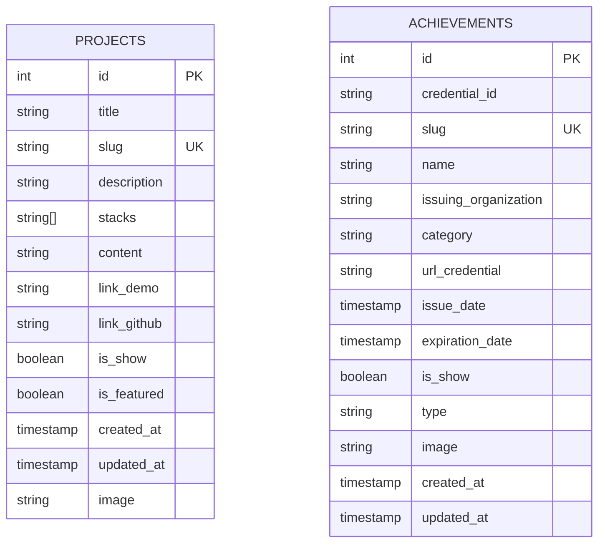

# Product Requirements Document (PRD)
## Project: Satria Bahari Personal Portfolio & Interactive Developer Platform
**Target URL Analyzed:** `https://satriabahari.my.id/en` (and localized Indonesian counterpart `https://satriabahari.my.id/id`)  
**Document Version:** 1.1.0  
**Status:** Approved / Scope Refined (Creator Hub, Guestbook/Chat, Command Palette, and AI Chatbot excluded)  
**Author:** AI Systems Architect & Product Analyst  
**Date:** September 2026  

---

## 1. Executive Summary & Vision

### 1.1 Product Vision
The Satria Bahari Portfolio platform is a high-performance, full-stack developer showcase engineered to position a professional Software Engineer at the intersection of technical excellence, transparent productivity, and architectural quality.

The application serves three primary functions:
1. **A Technical Showcase:** Demonstrating modern frontend and backend engineering capabilities (Next.js App Router, TypeScript, Tailwind CSS, Supabase, Prisma ORM, and Framer Motion).
2. **A Real-Time Developer Dashboard:** Aggregating and visualizing live telemetry from development platforms (GitHub activity, WakaTime coding metrics, Monkeytype typing speed, and Umami web analytics).
3. **An Internationalized Digital Identity:** Full bilingual support (`/en` and `/id`) with locale routing and dynamic OpenGraph image generation.

### 1.2 Core Value Proposition
- **For Tech Recruiters & Hiring Managers:** Instant, verifiable proof of software proficiency, live code metrics, detailed career timelines, and verifiable credentials.
- **For Engineering Leaders:** Demonstrates full-stack architectural maturity, clean code structure, API integration reliability, database design, and modern UX patterns.
- **For Developer Peers & Engineering Visitors:** A focused, interactive space with multi-theming (including seasonal themes like Ramadan & Valentine) and real-time development statistics.

---

## 2. User Personas & Target Audiences

| Persona | Role & Goals | Key Needs & Touchpoints |
| :--- | :--- | :--- |
| **Tech Recruiter / Talent Acquisition** | Evaluating candidate for software engineering roles (Full-Stack, Next.js, Android/Kotlin). | Quick access to Resume download, Career timeline, Verified skills, Contact links, and featured production projects. |
| **Engineering Manager / Tech Lead** | Assessing code quality, system architecture knowledge, and technical depth. | Direct access to GitHub repositories, Live demo links, System architecture details, and Dashboard metrics (GitHub heatmap, WakaTime hours). |
| **Developer Peer / Mentee** | Seeking inspiration, tech stack guidance, and code standards. | Exploring tech stack badges, typing speed on Monkeytype, GitHub contribution heatmap, and project case studies. |
| **Client / Business Stakeholder** | Considering freelance, contract, or advisory software services. | Contact form, social cards, portfolio project case studies, and "Open to Work" availability beacon. |
| **Portfolio Owner (Admin)** | Maintaining personal brand, publishing projects, managing credentials. | Supabase/Prisma database integration, dynamic storage, analytics review, and resume updates. |

---

## 3. Information Architecture & Sitemap

### 3.1 Route Hierarchy
```
satriabahari.my.id
├── /en (English Locale)
│   ├── /en                  -> Home (Hero, Skills Matrix, Bento Grid, Highlights)
│   ├── /en/about            -> About (Narrative Bio, Career Timeline, Education)
│   ├── /en/projects         -> Projects Showcase (Filterable project cards)
│   ├── /en/projects/[slug]  -> Project Case Study (Rich MDX breakdown)
│   ├── /en/achievements     -> Certifications & Badges (Multi-filter catalog)
│   ├── /en/dashboard        -> Real-Time Developer Metrics (GitHub, WakaTime, Monkeytype)
│   └── /en/contact          -> Social Cards & Direct Nodemailer Form
├── /id (Bahasa Indonesia Locale)
│   └── (Mirror of all /en routes localized into Indonesian)
├── /links                   -> Mobile-First Bio Link Hub (Linktree Alternative)
├── /sitemap.xml             -> Auto-generated multi-locale sitemap
├── /robots.txt              -> Search bot directives
└── /api/...                 -> REST endpoints & Webhooks
```

### 3.2 Layout & Navigation Shell
- **Desktop Sidebar Navigation:** A sticky left sidebar containing:
  - Profile Avatar (with hover zoom and pulse skeleton loader)
  - Verified Name Badge (`Satria Bahari` + blue verified icon)
  - "Open to Work" pulsating status beacon
  - Theme Switcher (Light / Dark / Yellow / Ramadan / Valentine)
  - Navigation Layout Mode toggle (collapsible sidebar / top navbar)
  - Primary Navigation Links with active state indicators and animated icons:
    - Home
    - About
    - Projects
    - Achievements
    - Dashboard
    - Contact
  - Copyright statement
- **Mobile Navigation:**
  - Sticky top header with avatar, name, and quick theme toggle
  - Responsive bottom navigation drawer or slide-out menu with smooth touch interactions.

---

## 4. Functional Requirements by Module

### 4.1 Global Layout & Shell Components

#### 4.1.1 Multi-Theme Engine
- **Supported Themes:** `light`, `dark`, `yellow`, `ramadan`, `valentine`.
- **Behavior:**
  - Theme state stored in `localStorage` and synced with Next-Themes / document root classes (`class="dark"`, `class="yellow"`, etc.).
  - Automatic system color scheme detection fallback.
  - Theme-specific accents:
    - *Dark:* Sleek neutral zinc/slate dark surfaces with high-contrast text.
    - *Light:* Clean white/neutral surfaces with soft border contrasts.
    - *Yellow:* Amber-tinted background, warm highlight borders.
    - *Ramadan:* Emerald/gold islamic motifs, deep emerald backgrounds with amber/gold accents.
    - *Valentine:* Soft rose/blush gradients, pinkish badges, romantic aesthetic.

#### 4.1.2 Live Status Beacon
- Animated pulsating beacon displaying current work status: `"Open to Work"` or `"Working on [Project]"`.
- Subtly draws recruiter attention without obstructing content.

#### 4.1.3 Internationalization (i18n)
- Seamless URL routing prefixing: `/en/...` for English and `/id/...` for Bahasa Indonesia.
- Locale switcher dropdown/toggle allowing 1-click instantaneous locale switching while preserving current subpage path.
- Localized dictionaries for all interface text, dates, and metadata via `next-intl`.

---

### 4.2 Home Page (`/[locale]`)

#### 4.2.1 Hero Section
- **Greeting & Identity:** "Hi, I'm Satria Bahari" with location tag (`Based in Jambi, Indonesia 🇮🇩`) and work preference badge (`Onsite` / `Hybrid` / `Remote`).
- **Bio Summary:** High-impact overview highlighting specialization in scalable web platforms (Next.js, TypeScript) and native mobile apps (Kotlin).
- **Core Call to Actions:** Direct navigation to About narrative, Projects, and Contact.

#### 4.2.2 Skills Matrix Component
- **Categorized Filter Tabs:**
  - `All` (36 total skills)
  - `Main` (Core stack: Next.js, TypeScript, React, Kotlin, Tailwind)
  - `Frontend` (17 items: HTML, CSS, Bootstrap, TailwindCSS, JavaScript, TypeScript, React.js, Next.js, Redux, Vue.js, Vite, etc.)
  - `Backend` (8 items: Go/Golang, Node.js, Express, Nest.js, REST APIs, GraphQL, etc.)
  - `Mobile` (2 items: Kotlin, Android Studio)
  - `Database` (4 items: PostgreSQL, MySQL, Supabase, Prisma ORM)
  - `Tools` (5 items: Git, GitHub, Docker, Postman, Vercel)
- **UI Interaction:**
  - Interactive pill buttons with animated badge counts.
  - Hover effects, brand-specific SVG icons, glowing color tints matching technology branding.

#### 4.2.3 Featured Bento Grid / Section Previews
- High-level teaser cards directing visitors to:
  - Latest featured project preview with live demo link.
  - Top achievements and credentials summary.
  - Real-time developer telemetry teaser (WakaTime / GitHub activity snapshot).

---

### 4.3 About Page (`/[locale]/about`)

#### 4.3.1 Extended Narrative & Personal Philosophy
- Personal journey from early software exploration in Jambi to building production web and mobile systems.
- Emphasis on software architecture, maintainability, clean code, proactive communication, and leadership.

#### 4.3.2 Interactive Career Timeline
- Chronological work history entries:
  - **Pt. Affan Technology Indonesia (Parto.id):** *Backend Golang Developer* (Jul 2025 - Sep 2025 • Internship • Hybrid).
  - **Himpunan Mahasiswa Sistem Informasi Universitas Jambi (HIMASI UNJA):** *Head of Technology in Research & Technology Division* (Dec 2024 - Dec 2025 • 1 year • Part-time • Onsite).
  - **Bangkit Academy led by Google, GoTo, Traveloka:** *Mobile Development Cohort* (Feb 2024 - Jul 2024).
- **Component Features:**
  - Company logo / icon, position title, duration, location, employment type.
  - Accordion toggle `"Show details"` / `"Hide details"` revealing responsibilities, architectural accomplishments, and tech stack utilized.

#### 4.3.3 Education History
- Formal education milestones (Universitas Jambi - Information Systems, SMAN 1 Tanjung Jabung Barat) with degrees, dates, GPA/honors, and activities.

#### 4.3.4 Document Downloads
- Direct download buttons with analytics event tracking:
  - `Download Resume / CV (PDF)`
  - `Download Portfolio Document (PDF)`

---

### 4.4 Projects Showcase (`/[locale]/projects` & `/[locale]/projects/[slug]`)

#### 4.4.1 Projects Catalog (`/projects`)
- Grid layout of personal, client, and open-source projects.
- **Card Data Model:**
  - Cover Image (WebP format with Supabase public storage CDN URL).
  - Project Title & Slug.
  - Short Description.
  - Tech Stack Badges (e.g., Next.js, TypeScript, TailwindCSS, Prisma, Supabase).
  - External Action Links:
    - `Live Demo` (opens external deployed application in new tab).
    - `Source Code` (opens GitHub repository).
    - `View Case Study` (navigates to `/projects/[slug]`).
- **Filtering & Search:** Real-time search by keyword and filter by technology stack tag.

#### 4.4.2 Project Case Study Detail (`/projects/[slug]`)
- Dynamic server-rendered page using Next.js App Router dynamic routes.
- High-resolution hero banner, live demo URL, repository link, and project timeline.
- Comprehensive MDX / Markdown body:
  - Overview & Problem Statement.
  - Architectural Design & System Flow.
  - Challenges Overcome & Performance Optimizations.
  - Key Lessons Learned.

---

### 4.5 Achievements & Certifications (`/[locale]/achievements`)

#### 4.5.1 Credential Catalog
- Comprehensive repository of 56+ verified certificates, licenses, and event recognitions.
- **Card Data Structure:**
  - Certificate Image preview.
  - Certificate Title (e.g., *Belajar Dasar HTML*, *Architecting on AWS*).
  - Issuing Organization (e.g., CODEPOLITAN, Dicoding Indonesia, Google, AWS, Coursera).
  - Issue Date and Expiry Date.
  - Credential ID.
  - Direct Verification URL (`url_credential`).
  - Category tag (`frontend`, `backend`, `cloud`, `mobile`, `database`).
  - Type tag (`course`, `certification`, `badge`, `award`).

#### 4.5.2 Filtering, Searching & Sorting
- Dynamic dropdown filters:
  - **Filter by Type:** All, Course, Certification, Badge.
  - **Filter by Category:** All, Frontend, Backend, Mobile, Cloud, General.
- Real-time text search for certificate or organization name.
- Dynamic counter: displays exact matching results (`Total: X`).

---

### 4.6 Developer Metrics Dashboard (`/[locale]/dashboard`)

The dashboard transforms the website into a transparent developer productivity monitor via 5 live telemetry widgets:

#### 4.6.1 GitHub Activity Widget (`/api/github`)
- Direct integration with GitHub GraphQL API (`https://api.github.com/graphql`).
- Displays:
  - Total public repositories count.
  - Total followers & following metrics.
  - Pinned Repositories with live star counts and fork numbers.
  - **Interactive Contribution Calendar (Heatmap):** 52-week green-scale contribution grid visualizing every commit, PR, and code review over the past year.

#### 4.6.2 WakaTime Coding Time Telemetry (`/api/read-stats`)
- Real-time coding habits tracked across IDEs (VS Code, Android Studio) via WakaTime API:
  - Coding time over the past 7 days.
  - Daily average coding duration (e.g., `2 hrs 31 mins/day`).
  - Best day record (e.g., `3 hrs 36 mins`).
  - Language breakdown percentages (e.g., Kotlin 95.6%, TypeScript, Go, CSS).
  - Editor breakdown (VS Code vs Android Studio).

#### 4.6.3 Monkeytype Typing Performance Widget (`/api/monkeytype`)
- Integration with Monkeytype user profile (`SatriaAxel`):
  - Completed typing tests counter.
  - Best Words Per Minute (WPM) speed.
  - Accuracy percentage (e.g., 100%).
  - Current streak and typing XP.

#### 4.6.4 Codewars Competitive Programming (`/api/codewars`)
- Kata ranking (kyu grade), overall honor score, and solved algorithmic challenge metrics.

#### 4.6.5 Umami Privacy Analytics (`/api/umami`)
- Real-time website visitor analytics:
  - Total page views and unique visitors.
  - Real-time visitor counter badge.

---

### 4.7 Contact & Inquiry Module (`/[locale]/contact`)

#### 4.7.1 Social Connect Cards
Interactive card grid with direct CTA buttons:
- **Gmail:** Direct email link (`Go to gmail`).
- **Instagram:** Direct profile link (`Go to instagram`).
- **LinkedIn:** Professional profile link (`Go to linkedin`).
- **GitHub:** Code repository profile (`Go to github`).

#### 4.7.2 Direct Message Contact Form
- **Form Fields:**
  - Sender Name (`required`)
  - Sender Email (`required`, validated email regex)
  - Message Subject (`optional`)
  - Message Body (`required`, min length 20 characters)
- **Backend Processing:**
  - Next.js API Route (`/api/email`) powered by `nodemailer`.
  - Sends formatted HTML email notification directly to the owner's inbox.
  - Anti-spam protections (honeypot field, rate-limiting).
  - Success modal with confetti burst animation (`canvas-confetti`).

---

### 4.8 Mobile Bio Hub (`/links`)

- Dedicated ultra-lightweight link aggregator page (alternative to Linktree):
  - Compact profile card (Avatar, title, location).
  - High-priority links: Portfolio Home, Monkeytype profile, Saweria donation platform, Direct Email.
  - Quick share button to copy link or share via Web Share API.

---

## 5. Technical Architecture & Tech Stack

```
+-----------------------------------------------------------------------+
|                              CLIENT TIER                              |
|  Next.js 14 App Router  |  React 18  |  TypeScript  |  Tailwind CSS    |
|  Framer Motion  |  GSAP  |  Lenis Scroll  |  next-themes  |  next-intl |
+-----------------------------------------------------------------------+
                                  |
                                  v
+-----------------------------------------------------------------------+
|                           NEXT.JS API TIER                            |
|   /api/projects      /api/achievements      /api/github               |
|   /api/read-stats    /api/monkeytype        /api/email                |
|   /api/codewars      /api/umami             /api/og                   |
+-----------------------------------------------------------------------+
         |                     |                     |
         v                     v                     v
+------------------+   +------------------+   +-------------------------+
|     DATABASE     |   |   EXTERNAL APIS  |   |     MEDIA & EMAIL       |
| Supabase (PgSQL) |   | GitHub GraphQL   |   | Supabase Object Storage |
| Prisma ORM       |   | WakaTime REST    |   | Cloudinary CDN          |
|                  |   | Monkeytype API   |   | Nodemailer SMTP         |
|                  |   | Umami Analytics  |   |                         |
+------------------+   +------------------+   +-------------------------+
```

### 5.1 Tech Stack Matrix

| Layer | Technologies Selected | Rationale |
| :--- | :--- | :--- |
| **Framework** | Next.js 14 (App Router) | Server-Side Rendering (SSR), Static Site Generation (SSG), Incremental Static Regeneration (ISR), Route Handlers, Turbopack support. |
| **Language** | TypeScript (Strict Mode) | Type safety across API responses, component props, and database entities. |
| **Styling** | Tailwind CSS + CSS Variables | Utility-first, responsive design, easy multi-theme token abstraction. |
| **Animation & UX** | Framer Motion, GSAP, Lenis, AOS | Fluid page transitions, micro-interactions, smooth momentum scrolling. |
| **Data Fetching** | SWR + unstable_cache | Client-side revalidation, caching, optimistic UI updates. |
| **Internationalization** | `next-intl` | Seamless locale routing (`/en`, `/id`), localized metadata, zero client bundle bloat. |
| **Database & Storage** | Supabase (PostgreSQL) + Prisma ORM | Relational data for projects & achievements; S3-compatible asset bucket for images. |
| **Email Service** | Nodemailer | Transactional email forwarding for contact inquiries. |
| **Analytics** | Umami Analytics + Vercel Analytics | Privacy-respecting, lightweight visitor telemetry without third-party tracking cookies. |

---

## 6. Database Schema Design (Prisma / Supabase)

### 6.1 Entity Relationship Diagram



### 6.2 Data Models

#### Model: `projects`
```prisma
model Project {
  id          Int       @id @default(autoincrement())
  title       String
  slug        String    @unique
  description String
  stacks      String[]  // Array of strings e.g. ["TypeScript", "Next.js"]
  content     String?   @db.Text
  link_demo   String?
  link_github String?
  is_show     Boolean   @default(true)
  is_featured Boolean   @default(false)
  created_at  DateTime  @default(now())
  updated_at  DateTime  @updatedAt
}
```

#### Model: `achievements`
```prisma
model Achievement {
  id                   Int       @id @default(autoincrement())
  credential_id        String
  slug                 String    @unique
  name                 String
  issuing_organization String
  category             String    // "frontend" | "backend" | "mobile" | "database" | "cloud"
  type                 String    // "course" | "certification" | "badge"
  url_credential       String
  issue_date           DateTime
  expiration_date      DateTime?
  is_show              Boolean   @default(true)
  created_at           DateTime  @default(now())
  updated_at           DateTime  @updatedAt
}
```

---

## 7. API Specifications & Integration Contracts

### 7.1 Internal API Endpoints

| Endpoint | Method | Purpose | Response Payload |
| :--- | :--- | :--- | :--- |
| `/api/projects` | `GET` | Fetches all visible projects with public storage image URLs. | `{ success: true, data: Project[] }` |
| `/api/projects/[slug]` | `GET` | Fetches a single project detail with markdown content. | `{ success: true, data: Project }` |
| `/api/achievements` | `GET` | Returns list of certificates, filterable by type/category. | `{ success: true, data: Achievement[] }` |
| `/api/github` | `GET` | Proxies GitHub GraphQL API, cached with ISR (60 min). | `{ success: true, data: { followers, following, repositories, pinnedItems, contributionsCollection } }` |
| `/api/read-stats` | `GET` | Fetches aggregated 7-day WakaTime statistics. | `{ success: true, data: { start_date, end_date, daily_average, total_hours, languages, editors } }` |
| `/api/monkeytype` | `GET` | Returns Monkeytype user profile typing stats. | `{ success: true, data: { name, typingStats, personalBests } }` |
| `/api/email` | `POST` | Dispatches contact form inquiry to owner inbox. | `{ success: true, message: "Email sent successfully" }` |
| `/api/og` | `GET` | Generates dynamic OpenGraph SVG/PNG images with `@vercel/og`. | `Image buffer (1200x630)` |

---

## 8. Non-Functional Requirements (NFRs)

### 8.1 Performance & Core Web Vitals
- **Target Metrics:**
  - Largest Contentful Paint (LCP): `< 1.2s`
  - First Input Delay (FID) / Interaction to Next Paint (INP): `< 100ms`
  - Cumulative Layout Shift (CLS): `< 0.05`
  - Lighthouse Score: `> 95` across Performance, Accessibility, Best Practices, and SEO.
- **Optimization Tactics:**
  - Images served via Supabase Storage CDN in next-gen `.webp` or `.avif` with strict responsive `srcset` definitions.
  - Font optimization using Next.js `next/font` (Inter font preloaded locally with zero FOIT/FOUT).
  - Route Handlers cached using Next.js `unstable_cache` with revalidation intervals (e.g., GitHub stats cached for 1 hour, WakaTime cached for 2 hours).

### 8.2 Security
- **Data Protection & Sanitization:**
  - Strict input validation and sanitization on contact form submissions.
  - Environment variables strictly segmented: client-safe keys prefixed with `NEXT_PUBLIC_`, private keys (GitHub PAT, WakaTime API key, SMTP credentials, Supabase service keys) restricted to server runtimes.
- **HTTP Security Headers:**
  - `Content-Security-Policy`, `X-Frame-Options: DENY`, `X-Content-Type-Options: nosniff`, `Strict-Transport-Security: max-age=63072000`.

### 8.3 Accessibility (a11y)
- WCAG 2.1 AA Compliance across all 5 themes.
- Proper contrast ratios (minimum 4.5:1 for normal body text).
- Semantic HTML (`<main>`, `<header>`, `<nav>`, `<section>`, `<article>`).
- Full keyboard focus management across modals, interactive cards, and dropdown menus.
- Descriptive `aria-label` attributes on all icon-only buttons (theme switcher, layout switcher, social buttons).

### 8.4 Search Engine Optimization (SEO) & Social Graph
- Dynamic OpenGraph image generation via `/api/og?title=...&description=...` rendering branded social share preview cards (1200x630).
- Fully validated `sitemap.xml` with bilingual entries and change frequencies.
- Valid `robots.txt` restricting `/api/` scraping while permitting search engine indexing.
- JSON-LD structured data: `Person`, `WebSite`, and `ProfilePage` schemas.

---

## 9. Implementation Roadmap & Phased Execution

| Phase | Milestone | Scope & Deliverables |
| :---: | :--- | :--- |
| **Phase 1** | **Foundation & Shell System** | Next.js 14 project setup, TypeScript configuration, Tailwind CSS setup, Next-Themes multi-theming engine (5 themes), next-intl localization (`en` & `id`), Responsive sticky sidebar & mobile layout. |
| **Phase 2** | **Core Identity Pages** | Home page (Hero, Skills matrix filter, Bento grid), About page (narrative, collapsible career timeline, education, resume download), Contact page (social cards, nodemailer email form). |
| **Phase 3** | **Content & Credentials Hub** | Supabase database connection, Projects showcase page, dynamic project MDX slug view, Achievements catalog with multi-type and multi-category filters. |
| **Phase 4** | **Developer Telemetry Dashboard** | GitHub GraphQL API integration & heatmap, WakaTime 7-day stats integration, Monkeytype typing speed widget, Umami analytics integration. |
| **Phase 5** | **Interactive Polish** | Seasonal theme switchers, live status beacon, sound/confetti interactions, modal animations. |
| **Phase 6** | **Performance & Production Launch** | Dynamic OG image generator, Lighthouse performance tuning, SEO structured data, and production deployment on Vercel. |

---

## 10. Success Metrics & Verification Criteria

1. **Portfolio Discovery:** Search visibility across major search engines for developer keywords (*Satria Bahari, Full-Stack Developer, Next.js Android Engineer*).
2. **Visitor Engagement:** Average session duration `> 2.5 minutes` and low bounce rate (`< 40%`) as reported by Umami analytics.
3. **Recruiter Conversion:** Measurable clicks on Resume Download and Contact/Email actions.
4. **Zero Downtime & API Resilience:** Automated graceful fallbacks when external APIs (GitHub, WakaTime) experience upstream throttling or network disruptions.
